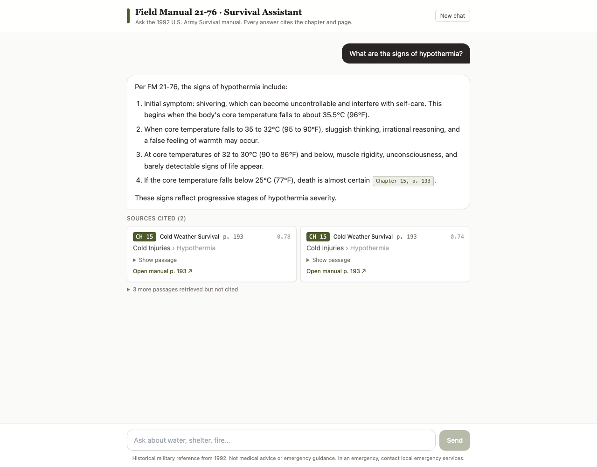

# Field Manual 21-76 · Survival Assistant

A retrieval-augmented chatbot over the U.S. Army's 1992 survival manual, **FM 21-76 *Survival***. Ask how to build a solar still, find north without a compass, or recognize hypothermia. Every answer cites the chapter and page, and each citation opens that page of the PDF.

**Live:** https://field-manual-rag-neon.vercel.app



Built with Next.js 15, the Vercel AI SDK (v4, `streamText` + tool calling), OpenAI (`gpt-4.1-mini`, `text-embedding-3-small`), and Upstash Vector. The app is corpus-agnostic: a second corpus (a Philippine Senate bill) runs on the same code with nothing changed but an env var.

> Historical military reference from 1992. Not medical advice or emergency guidance.

## How it works

```
question ─► gpt-4.1-mini ──(decides)──► searchManual tool ─► embed query ─► Upstash (namespace fm21-76)
                │                                                              │
                │◄──────── top 5 passages + chapter/section/page + PDF link ◄──┘
                ▼
     streamed answer with [Chapter 6, p. 78] citations ─► UI: citation chips + source cards
```

- **RAG as a tool call.** Retrieval is a tool (`searchManual`) that the model chooses to call. Substantive questions trigger a search; greetings and "what can you do?" don't. The tool takes an optional `chapter` filter. The filter narrows results but never excludes: the three best unfiltered hits are always merged in, so a wrong chapter guess can't hide the answer.
- **Grounding rules** (in [`lib/prompt.ts`](lib/prompt.ts)): answer only from retrieved passages, cite every factual sentence, keep CAUTION/WARNING/Note qualifiers, never reconstruct a figure's content, and say plainly when the manual doesn't cover something.
- **Figure warnings.** Figures in the PDF are images, so their contents never reach the text. When a retrieved passage mentions "Figure 9-5", the tool result tells the model that the figure's contents aren't available, and the model points the reader to the figure instead of making up its steps.
- **Guards.** The endpoint is public and spends an API key, so it caps messages at 2000 chars, sends only the last 12 messages, sets `maxDuration = 30`, and sanitizes errors. No secrets or prompts reach the client bundle; only UI fields from the config are passed to the browser.

## The corpus

| | |
|---|---|
| Document | *FM 21-76 / MCRP 3-02F, Survival*, Headquarters, Department of the Army, 5 June 1992 |
| Source | Internet Archive, [`MCRP_3-02F_FM_21-76_Survival`](https://archive.org/details/MCRP_3-02F_FM_21-76_Survival) (the official Word/Distiller PDF with a real text layer) |
| License | U.S. Government work, not subject to copyright in the U.S. (17 U.S.C. § 105) |
| Indexed | Chapters 1–23, PDF pages 4–307 (~500k characters). The appendices (plant and snake catalogues, mostly photos) are left out, and the committed PDF is trimmed to pages 1–307 (5.7 MB) |

**Why this corpus:** it's public domain, strongly structured (chapters, ALL-CAPS sections, Title-Case subsections, bulleted procedures), and a wrong answer is easy to spot. Several archive.org copies were rejected because they are retyped reprints without the original layout.

## Chunking: why it looks like this

Default fixed windows would split procedures in half, so the chunker ([`lib/ingest/chunk.ts`](lib/ingest/chunk.ts)) follows the manual's structure:

1. **Page-accurate extraction.** Each page is rendered with pdf-parse's `pagerender`, with text items joined by x-gap. The starter split pdf-parse output on `\f`, which tagged every chunk as page 1, and joining items with plain spaces broke words ("catc hing").
2. **Headings.** `CHAPTER N` starts a group, ALL-CAPS lines start sections, and short Title-Case lines become subsections. `CAUTION` / `WARNING` / `NOTE` are recognized as callouts, not headings, and stay inline.
3. **Procedures stay whole.** A lead-in ending in `--` or `:` ("To make the still--") is kept together with the bullets that follow, up to 2× the target size. When a chunk overflows, it is split at the last subsection heading in preference to mid-topic.
4. **Crumbs are merged.** Sections shorter than 400 characters (a chapter intro, a one-list section) are folded into a neighbor in the same chapter.
5. **Context header.** Each chunk is embedded with a header such as `Chapter 6: Water Procurement › Still Construction › Aboveground Still`, so short procedural chunks still match their topic.

Settings: target 1200 chars, 200 overlap within a section, minimum 400. The result is **562 chunks, median 855 chars**, with every chapter represented. Metadata per chunk: `docId, docTitle, file, pdfPage, pageEnd, group (chapter), groupNum, section, subsection, text`.

## Evaluation

`npm run eval -- --corpus fm21-76` measures retrieval. Adding `--full` runs the real chat end to end, and a `gpt-4.1` judge then checks each claim in the answer against the passages the model actually retrieved. Questions are in [`corpora/fm21-76/evals.json`](corpora/fm21-76/evals.json): 19 answerable (with expected chapter and page), 4 the manual can't answer, and 2 small-talk.

**Retrieval:** hit@1 89%, hit@3 100%, hit@5 100%, MRR 0.947.

**End to end** (one run of each configuration):

| Chat model | topK | Answerable (tool used + correct page cited) | Out-of-scope refused | Small talk without tool | Grounded (judge) |
|---|---|---|---|---|---|
| **gpt-4.1-mini** | **5** | **19/19** | **4/4** | **2/2** | **23/23** |
| gpt-4.1-mini | 8 | 19/19 | 4/4 | 2/2 | 19/23 |
| gpt-4o-mini | 5 | 19/19 | 4/4 | 2/2 | 20/23 |
| gpt-4o-mini | 8 | 19/19 | 4/4 | 2/2 | 18/23 |

**Re-run on the deployed prompt** (after making the figure rule generic): 19/19 · 4/4 · 2/2 · grounded 20/23 by raw judge score. On manual review, all three flags are sentences saying what the manual does *not* cover ("the meanings of R, V, I are not provided in the retrieved text"), which the judge is told to ignore. They are judge false positives, not hallucinations.

What the numbers changed:
- **The model changed from `gpt-4o-mini` to `gpt-4.1-mini`.** The Universal Edibility Test steps exist only in Figure 9-5, an image. `gpt-4o-mini` recited the steps from memory in every run, even with prompt rules and the per-passage figure warning; `gpt-4.1-mini` pointed to the figure.
- **topK stays at 5.** With more passages in context, both models padded their answers with unsupported detail.
- **`minScore` can't catch out-of-scope questions.** Unanswerable questions reach similarity 0.74, above the lowest correct hit (0.73), so refusing has to come from the model. `minScore` (0.3) only filters junk.

## Run it locally

Requires Node 22+ (`.nvmrc` pins 24). There are no global installs; the Vercel CLI is a dev dependency.

```bash
git clone https://github.com/metromark/field-manual-rag.git
cd field-manual-rag
nvm use            # optional
npm ci             # also runs prepare-corpora (registry + PDFs into public/)
npm run setup      # checks Node, creates .env.local from .env.example
# fill in .env.local (see below)
npm run seed -- --corpus fm21-76     # ~560 embeddings, well under $0.01
npm run dev                          # http://localhost:3000
```

**Environment** ([`.env.example`](.env.example)):

| Variable | Where to get it |
|---|---|
| `OPENAI_API_KEY` | platform.openai.com/api-keys |
| `UPSTASH_VECTOR_REST_URL`, `UPSTASH_VECTOR_REST_TOKEN` | console.upstash.com/vector. Create an index with **1536 dimensions, COSINE, no built-in embedding model** (the seed script checks this) |
| `CORPUS_ID` | Which corpus to serve (`fm21-76` default, or `ph-sb25`) |
| `CHAT_MODEL` | Optional override (default `gpt-4.1-mini`) |

**Scripts:** `seed` (add `--dry-run` to chunk only and write `scratch/chunks-<id>.jsonl`), `eval` (`--full`, `--topK N`, `--minScore X`, `--only id1,id2`), `typecheck`, `build`.

## Deploy (Vercel)

```bash
npm run vercel:link                      # after `npx vercel login`
npx vercel env add OPENAI_API_KEY production   # repeat for the Upstash vars and CORPUS_ID
npm run deploy                           # vercel deploy --prod
```

`prebuild` copies each corpus's PDFs into `public/corpora/<id>/`, so citation deep links work in production. Turn off Deployment Protection if the URL must be public.

## Add your own corpus

Adding a corpus means adding a folder; no code changes:

1. Create `corpora/<your-id>/docs/` and put your PDF(s) there. They need a real text layer.
2. Copy [`corpora/ph-sb25/corpus.config.ts`](corpora/ph-sb25/corpus.config.ts) to `corpora/<your-id>/corpus.config.ts` and edit the name, prompt, tool description, prompt chips and accent color. Start with `strategy: 'fixed'`; switch to `'headings'` with your own patterns if the document has a clear heading hierarchy. The config is validated by a zod schema ([`lib/corpus.ts`](lib/corpus.ts)), so mistakes fail loudly.
3. `npm run seed -- --corpus <your-id> --dry-run`, inspect the chunks, then seed for real. Each corpus gets its own Upstash namespace, so one index can hold several.
4. Optionally add `corpora/<your-id>/evals.json` and run `npm run eval -- --corpus <your-id> --full`.
5. Set `CORPUS_ID=<your-id>`.

The included second corpus, **Philippine Senate Bill No. 25** (the proposed AI Regulation Act; a work of the Philippine government, R.A. 8293 §176), uses fixed 800/100 chunking and strips margin line numbers. `CORPUS_ID=ph-sb25` switches the title, chips, prompt, tool, sources and accent color.

## Project layout

```
app/api/chat/route.ts        chat endpoint: guards + streamText with the corpus tool
app/page.tsx, layout.tsx     server components: pass UI config, metadata, OG image
components/Chat.tsx          client chat UI (useChat, citations, source cards)
lib/corpus.ts                CorpusConfig schema (zod) + types
lib/retrieval.ts             searchCorpus + makeSearchTool (shared by route and eval)
lib/prompt.ts, lib/chat.ts   grounding prompt and chat settings (shared by route and eval)
lib/ingest/                  extract → chunk → seed pipeline
lib/eval.ts                  retrieval metrics + end-to-end judged eval
corpora/<id>/                corpus.config.ts, docs/*.pdf, evals.json
scripts/                     prepare-corpora (registry + public PDFs), setup
```

## Known limitations

- **Figures are invisible.** About 150 pages carry diagrams, and some procedures (the Universal Edibility Test) exist only as figures. The bot points to the figure and its page instead of describing it.
- **Answers that span many chunks can be incomplete.** The SURVIVAL acronym covers pages 4–7. If top-5 misses a letter, the bot says which parts it couldn't find instead of filling them in.
- **No printed page labels.** This edition has no per-chapter page numbers ("6-3"), so citations use chapter + PDF page.
- **Content from 1992.** Medical guidance is historical. The UI and the prompt say so.
- **Eval size.** 23 judged questions, one run per configuration; the LLM judge still has some noise.

## Stretch goals

See [docs/stretch-goals.md](docs/stretch-goals.md): **suggested-prompt chips** and an **evaluation harness**.
